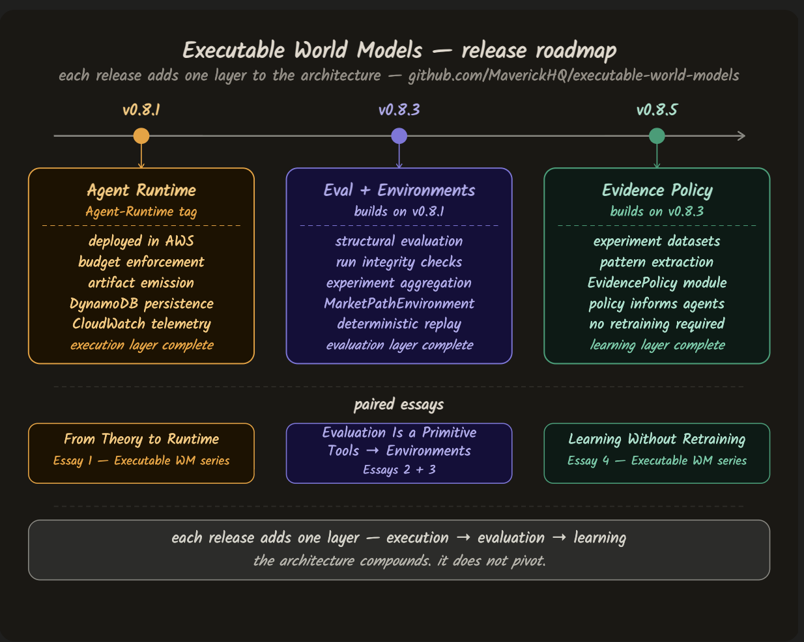

# ewm-core — Executable World Models

### Part of the Crucible project

This repository accompanies the **[Executable World Models](https://harveygill.substack.com/p/building-the-runtime-for-agent-based)** essay series published on Substack. It is the companion to the **[Beyond Tokens](https://github.com/MaverickHQ/beyond-tokens)** series, which established why world models matter. This series builds them.



---

## Install

```
# Core infrastructure only
pip install ewm-core

# With LLM agent (requires ANTHROPIC_API_KEY)
pip install ewm-core[llm]
```

## Agent modes

| Mode | Requires | Model |
|---|---|---|
| Rule-based agent | Nothing — default | — |
| LLM agent | `ANTHROPIC_API_KEY` env var | `claude-haiku-4-5-20251001` |

The LLM agent receives a market observation (price, SMA5, SMA10, volume, position) and returns a `buy / sell / hold` decision with a `reasoning` field.

```python
from ewm_core.agents import LLMAgent

agent = LLMAgent()  # reads ANTHROPIC_API_KEY from environment
decision = agent.decide({
    "symbol": "AAPL", "price": 182.5,
    "sma5": 183.1, "sma10": 180.2,
    "volume": 52_000_000, "position": "flat",
})
# {"type": "buy", "qty": 1, "source": "llm", "reasoning": "..."}
```

## Live demo

[Dashboard](https://crucible-ewm.streamlit.app) — synthetic market replay, trajectory viewer, artifact inspector

## Quick start

```python
# Rule-based agent (no API key needed)
from ewm_core.environment import MarketPathEnvironment
from ewm_core.eval import evaluate_artifact
from ewm_core.learning import build_evidence_policy

# LLM agent (requires ANTHROPIC_API_KEY)
from ewm_core.agents.llm_agent import LLMAgent
agent = LLMAgent(api_key=os.environ["ANTHROPIC_API_KEY"])
decision = agent.decide(observation)
# {"type": "buy", "symbol": "AMZN", "reasoning": "..."}
```

---

## What this repository builds

Most agent frameworks focus on what agents can do — tools, skills, orchestration. This project focuses on something different: what it takes for agent behavior to be **observable, reproducible, and improvable over time**.

The architecture is built in layers, each release adding one:

- **Execution** — a deterministic agent runtime deployed on AWS, executing decisions under explicit budget constraints and emitting structured artifacts for every run
- **Evaluation** — a structural validity layer that verifies artifact integrity before runs are treated as evidence
- **Environments** — a stateful world that evolves step by step, so agents interact with something that changes rather than just querying APIs
- **Learning** — an evidence policy that converts validated experiment results into decision guidance for future runs, without retraining the model

The result is a system that produces **trajectories**, not just outputs. Trajectories can be replayed, validated, compared across experiments, and used as the dataset from which intelligent systems can begin to improve.

---

## Releases

Each release adds one layer to the architecture. The system compounds — it does not pivot.

| Release | Layer added | Essay |
|---|---|---|
| [`v0.8.1-Agent-Runtime`](https://github.com/MaverickHQ/executable-world-models/releases/tag/v0.8.1-Agent-Runtime) | Execution — agent runtime deployed on AWS | [From Theory to Runtime](https://harveygill.substack.com/p/building-the-runtime-for-agent-based) |
| [`v0.8.3`](https://github.com/MaverickHQ/executable-world-models/releases/tag/v0.8.3) | Evaluation + environments — structural validity and deterministic world | [Evaluation Is a Primitive, Not a Report](https://harveygill.substack.com/p/evaluation-is-a-primitive-not-a-report) · [Tools Return Results. Environments Change the World.](https://harveygill.substack.com/p/tools-skills-and-the-missing-layer) |
| [`v0.8.5`](https://github.com/MaverickHQ/executable-world-models/releases/tag/v0.8.5) | Evidence policy — learning without retraining | [Learning Without Retraining](https://harveygill.substack.com/p/agents-that-learn-from-experiments) |
| [`v0.8.5.1`](https://github.com/MaverickHQ/executable-world-models/releases/tag/v0.8.5.1) | Policy-guided agent — evidence feeding future decisions | [Learning Without Retraining](https://harveygill.substack.com/p/agents-that-learn-from-experiments) |

---

## Essays

This series follows directly from [Beyond Tokens](https://github.com/MaverickHQ/beyond-tokens). That series made the case for why world models matter. This series runs that argument as infrastructure.

| Essay | What it covers |
|---|---|
| [Decisions That Don't Disappear](https://harveygill.substack.com/p/decisions-that-dont-disappear?r=3u3ngq) | Claude in the agent slot — inspectable decisions, auditable artifacts, and why this is different from any other LLM trading agent |
| [From Theory to Runtime](https://harveygill.substack.com/p/building-the-runtime-for-agent-based) | The Agent Runtime goes live on AWS — execution, artifacts, persistence, telemetry |
| [Evaluation Is a Primitive, Not a Report](https://harveygill.substack.com/p/evaluation-is-a-primitive-not-a-report) | Structural validation that turns runs into trusted evidence |
| [Tools Return Results. Environments Change the World.](https://harveygill.substack.com/p/tools-skills-and-the-missing-layer) | Why environments are the missing layer in most agent architectures |
| [Learning Without Retraining](https://harveygill.substack.com/p/agents-that-learn-from-experiments) | How agent systems improve decisions without changing the model |
| [The Architecture of Intelligent Systems](https://harveygill.substack.com/p/the-architecture-of-intelligent-systems) | What both series, taken together, mean for how intelligent systems are built |

**Recommended entry point:** start with [From Theory to Runtime](https://harveygill.substack.com/p/building-the-runtime-for-agent-based), which introduces the runtime and links directly to the code. Read the earlier [Beyond Tokens](https://harveygill.substack.com/p/beyond-tokens) series for the architectural argument that precedes it.

---

## Architecture

The system is a layered experimental stack. Each layer makes agent behavior more observable and improvable.

```
agents
↓
constraints        — budget: steps · tool calls · model calls · memory
↓
artifacts          — decision.json · trajectory.json · deltas.json
↓
evaluation         — structural validity · integrity checks
↓
experiments        — aggregate across runs · integrity rate · success rate
↓
environments       — stateful · deterministic · step-by-step
↓
evidence policy    — patterns → decision guidance · no retraining required
```

The upper layers generate behavior. The lower layers make that behavior observable, trustworthy, and learnable from.

---

## The learning loop

Version `v0.8.5` completes the learning loop. The architecture now runs end to end:

```
environment → trajectories → artifacts → evaluation
    → experiments → evidence dataset → evidence policy → future decisions
```

This is not reinforcement learning. No model weights are updated. No gradient descent occurs. What changes is the decision architecture — past experiment evidence informs future choices, without touching the model.

---

## Setup

```bash
make setup
make lint
pytest
```

---

## Local demo

```bash
python3 scripts/demo_learning_loop.py
```

**What you should see**

- Agent runs interact with the `MarketPathEnvironment` step by step
- Structured artifacts are written for each run — `decision.json`, `trajectory.json`, `deltas.json`
- Evaluation verifies structural integrity — valid runs proceed, invalid runs are excluded
- Experiments aggregate results across runs
- A learning dataset is exported from validated trajectories

---

## Evidence policy demo (v0.8.5)

```bash
# Export learning dataset from validated experiments
python3 scripts/export_learning_dataset.py

# Run the learner stub to produce a learning report
python3 scripts/run_learning_stub.py

# Build the evidence policy from the learning report
python3 scripts/build_evidence_policy.py \
  --learning-report outputs/learning/demo_learning_report.json \
  --output outputs/learning/evidence_policy.json

# Run the policy feedback loop demo
python3 scripts/demo_policy_feedback_loop.py
```

---

## Policy-guided agent demo (v0.8.5.1)

```bash
# Run the policy-guided agent
python3 scripts/demo_policy_guided_trading_agent.py

# Run the full end-to-end learning loop
python3 scripts/demo_end_to_end_learning_loop.py
```

**What you should see**

- Agent loads an evidence policy and consults it for each decision
- Symbol-level preferences take priority, then step-level preferences, then the default action
- Each decision includes an explanation of which policy source was used
- The complete loop from experiments to decisions runs end to end

---

## AWS deployment

```bash
make deploy-agentcore-loop
```

Verify health:

```bash
curl https://<your-api-gateway-url>/health
```

Run integration tests:

```bash
pytest tests/integration
```

---

## Repository structure

```
ewm_core/environment/        world environments — MarketPathEnvironment
ewm_core/eval/               structural evaluation layer
ewm_core/learning/           evidence policy and learning scaffold
services/cli/                operational CLI

scripts/                     demos, export tools, and policy builders
tests/                       unit and integration tests
infra/cdk/                   AWS infrastructure — API Gateway, Lambda, DynamoDB, S3
docs/                        architecture diagrams
outputs/learning/            experiment datasets and policy outputs
```

---

## How to evaluate this repository in 10 minutes

1. Run `python3 scripts/demo_learning_loop.py` and observe that every run produces structured artifacts
2. Check `outputs/learning/` — trajectories are exported as a clean dataset
3. Run `python3 scripts/demo_policy_guided_trading_agent.py` and observe decisions being guided by prior evidence
4. Open any `decision.json` artifact — the decision, trajectory, and state deltas are all explicit and inspectable
5. The model does not change. The system improves through architecture.
6. Set `ANTHROPIC_API_KEY` and run `python3 scripts/demo_llm_agent.py` — observe Claude reasoning about market observations and producing inspectable decisions recorded in the same artifact structure as the deterministic agent.

---

## Crucible project

ewm-core is the foundation layer of the Crucible research project — three repos, three essays, two domains.
- [crucible-ewm](https://github.com/MaverickHQ/crucible-ewm) — this repo
- [crucible-player-coach](https://github.com/MaverickHQ/crucible-player-coach) — adversarial quality loop (Phase 3)
- [crucible-autoresearcher](https://github.com/MaverickHQ/crucible-autoresearcher) — meta-loop improvement (Phase 4)

---

## Project status

Current milestone: **Phase 2 complete — LLMAgent**

The infrastructure layer is complete and the agent slot is operational. The deterministic agent and Claude LLM agent both run on the same artifact, evaluation, and experiment infrastructure.

Phase 3 introduces the player-coach architecture — a PlayerAgent that proposes actions and a CoachAgent that evaluates and rejects them before execution proceeds. The infrastructure is unchanged. The agent layer becomes adversarial.
