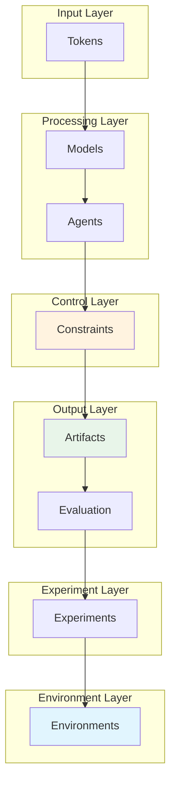

# Architecture

## Overview

Executable World Models (EWM) is a research framework for building deterministic, stateful planning systems that run locally or on AWS under strict cost and safety constraints.

The architecture follows a layered approach where each layer builds on the previous one:

```
Tokens → Models → Agents → Constraints → Artifacts → Evaluation → Experiments → Environments → Learning → Policy Feedback
```

## Stack Layers

### 1. Tokens

Raw input tokens that flow into the system. These are the fundamental units of computation.

### 2. Models

The language models (e.g., Claude, Bedrock) that process tokens and generate outputs. Models are invoked through a deterministic interface that tracks all calls.

### 3. Agents

Agent implementations that coordinate model calls, tool usage, and memory operations. The agent loop enforces hard budget boundaries on every execution.

### 4. Constraints

Budget enforcement mechanisms that halt execution when limits are exceeded:

- `max_steps`: Maximum number of agent steps
- `max_tool_calls`: Maximum number of tool invocations
- `max_model_calls`: Maximum number of model calls
- `max_memory_ops`: Maximum memory operations
- `max_memory_bytes`: Maximum memory bytes

### 5. Artifacts

Generated outputs from agent execution:

- Trade tapes: Sequence of trading actions
- Execution ledgers: Detailed execution logs
- State snapshots: Final state after execution

### 6. Evaluation

Evaluation framework that assesses agent behavior:

- Experiment configuration and execution
- Run evaluation against criteria
- Metrics collection and reporting

### 7. Experiments

Experiment definitions that combine:

- Strategy specifications
- Budget configurations
- Market paths
- Evaluation criteria

### 8. Environments (NEW)

The environment layer provides stateful world abstractions for agents to interact with.



## Current Runtime Stack

### Local Runtime

The local runtime includes:

- Deterministic market simulator
- JSON strategy specification (BUY / SELL / HOLD)
- State transition engine
- Tape and execution logs
- Replay tooling

### AWS Runtime (AgentCore)

The AWS deployment layers the same deterministic logic behind:

- Lambda handlers (Base, Tools, Memory, Loop)
- HTTP API Gateway
- S3 artifact storage
- Optional DynamoDB state persistence
- Strict budget enforcement

## Trading Environment Layer (Experimental)

The new **Trading Environment Layer** introduces a stateful world abstraction that sits above experiments.

### What It Is

- A deterministic market path replay environment
- A stateful interface where agents can step through market observations
- Designed to support future work in Essay 8 ("Agents Need Worlds")

### What It Is NOT

- A full execution simulator with order matching
- A broker with slippage modeling
- An RL trainer with reward optimization
- A world model implementation

### Components

1. **BaseEnvironment**: Abstract interface defining reset(), state(), and step() methods
2. **TradingEnvironment**: Concrete implementation that replays a deterministic market path
3. **MarketPathEnvironment**: Alias for TradingEnvironment

### Design Principles

- **Determinism**: Given the same market path and actions, outputs are always identical
- **Simplicity**: Returns plain dicts, no external library types
- **Optional**: Does not affect existing runtime/evaluation stack
- **Inspectable**: All state transitions are visible and logged

### Architecture Position

The environment layer sits at the top of the stack, connecting experiments to stateful world interactions:

```
Experiments → TradingEnvironment → Market Observations
                     ↓
              Agent Interaction
                     ↓
              Action History
```

This architectural bridge enables future work in:

- Planning with environmental feedback
- World model integration
- Multi-step agent experiments

## Compatibility

The trading environment layer is designed to be fully backward-compatible:

- Existing runtime/evaluation semantics are preserved
- No changes to existing AWS behavior
- All existing tests continue to pass
- New code is optional and not required by existing paths

## Fixture Schema

The `examples/fixtures/trading_environment_path.json` fixture defines a deterministic market path for use with `MarketPathEnvironment` (alias: `TradingEnvironment`).

### Fixture Shape

```json
{
  "description": "Human-readable description of the fixture",
  "symbols": ["AAPL", "MSFT"],
  "steps": [
    {
      "timestamp": "2024-01-02T09:30:00Z",
      "AAPL": 185.50,
      "MSFT": 370.25,
      "volume": 1000000
    }
  ]
}
```

### Field Descriptions

| Field | Type | Description |
|-------|------|-------------|
| `description` | string | Human-readable description of the fixture |
| `symbols` | array of strings | List of symbols in the market path |
| `steps` | array of objects | Market observations, one per timestep |
| `steps[].timestamp` | ISO8601 string (optional) | Timestamp for this step |
| `steps[].<symbol>` | float | Price for the given symbol at this step |
| `steps[].volume` | integer (optional) | Trading volume at this step |

The `steps` array represents the sequential market observations that `MarketPathEnvironment` will replay. Each step maps symbol strings to float prices. Additional metadata fields (timestamp, volume) are optional and ignored by the environment but available for downstream processing.

## Learning Loop Scaffold (Experimental)

The **Learning Loop Scaffold** provides infrastructure for consuming validated experiment trajectories as inputs for future adaptation. This is NOT RL training — it's a deterministic scaffold that proves the architecture can close the loop from experiments to learning.

### What It Is

- A deterministic trajectory export pipeline
- A selector for structurally valid runs
- A replay/iteration interface for trajectory datasets
- A stub learner that computes aggregate statistics
- Architecture proof-of-concept for Essay 10

### What It Is NOT

- RL training with reward optimization
- Policy-gradient learning
- A broker simulator
- Heavy ML framework dependent (no torch, tensorflow, ray)

### Architecture Position

The learning layer sits at the top of the stack, consuming validated trajectories from experiments:

```
Experiments → Selector → Dataset Export → Learning Dataset → Stub Learner → Learning Report
                                    ↓
                              JSONL Format
```

### Components

1. **Selector**: Selects structurally valid runs (manifest_valid=True, no integrity_errors)
2. **Dataset Export**: Converts trajectories to JSONL with one row per step
3. **Replay**: Iterates over exported datasets deterministically
4. **Stub Learner**: Computes aggregate statistics (action counts, symbol counts, heuristics)

### Design Principles

- **Determinism**: All outputs are deterministic (stable ordering, no randomness)
- **Trading-Focused**: Uses the trading/market-path example consistently
- **Backward-Compatible**: No changes to existing runtime semantics
- **Minimal**: No heavy ML dependencies
- **Essay 10 Aligned**: Only trusted experimental evidence enters the learning loop

## Policy Feedback Layer (NEW - v0.8.5)

The **Policy Feedback Layer** completes the learning loop by converting experiment evidence into a deterministic policy that can influence future trading decisions.

### What It Is

- A deterministic policy builder from learning reports
- A decision helper that applies evidence-based preferences
- A complete learning loop: experiments → evidence → policy → decisions
- Architecture proof that Essay 10's loop is closed

### What It Is NOT

- RL training with reward optimization
- Policy gradient learning
- Model weight training
- Stochastic decision making

### Architecture Position

The policy feedback layer completes the loop:

```
Experiments → Trajectories → Artifacts → Evaluation → Experiments 
                                              ↓
                           Evidence Dataset → Learning Report → Evidence Policy
                                                                 ↓
                                              Future Decisions ← Policy Consultation
```

### Components

1. **Evidence Policy**: JSON structure containing action preferences by symbol and step
2. **Policy Builder**: Converts learning reports to evidence policies
3. **Policy Applicator**: Applies policy to observations to produce decisions

### Decision Logic

The policy applicator uses simple deterministic rules:

1. If symbol has a known preference, use that action
2. Else if step position has a known preference, use that action
3. Else fall back to default_action (typically "hold")

### Design Principles

- **Determinism**: Same observation + same policy = same decision
- **Simplicity**: Plain dict-based implementation, no ML frameworks
- **Transparency**: Easy to understand what action was chosen and why
- **Backward-Compatible**: Can be used as optional enhancement, not required
- **Essay 10 Aligned**: Closes the architectural loop from experiments to decisions

## From Experiments to Decisions

The complete learning loop now works as follows:

1. **Run Experiments**: Execute agent experiments with market environments
2. **Collect Evidence**: Validate trajectories and aggregate into experiment datasets
3. **Analyze Evidence**: Run learner stub to produce learning report with heuristics
4. **Build Policy**: Convert learning report to evidence policy with action preferences
5. **Apply Policy**: Consult evidence policy when making new trading decisions

This loop demonstrates that validated experiment trajectories can meaningfully influence future behavior — without requiring RL training or heavy ML infrastructure.
